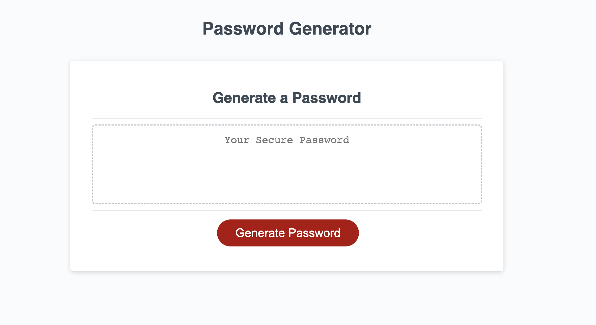
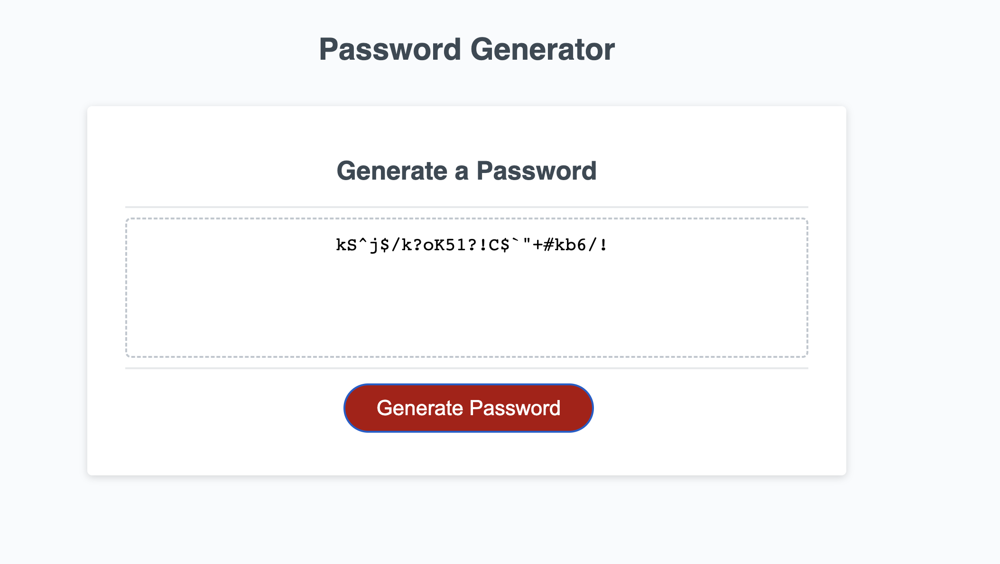

# Password-Generator

## About The Project

The goal of this project was to take a functional HTML, CSS, and JS file and then modify it such that a password is generated, specified to the users individualized needs, when they click the 'Generate Password' button. 

### Built With

* HTML 
* CSS
* JavaScript

## Getting Started

In order to acess this website, just visit the following webpage: [https://andrewbreytenbach.github.io/Password-Generator/]   (Password-Generator)

To get a local copy up and running, simply view the index.html file, stle.css, or the script.js file and see how you can play around, copy, and edit the file for personal usage. You can also change the password criteria to your personal needs by adjusting the if functions and the variables associated with each prompt. 

## Usage

Once the user fist acceses the website, the following image is what they will find: 

After clicking the 'Generate Password' red button, the user will be given a series of prompts asking them to enter in the number of characters they want the password to have, and then a series of prompts asking if it needs to be uppercase, lowercase, numeric, or containing symbols. Once all of these prompt boxes are selected, then the user is given a generated password in the text box as shown below:

Based on the answers given to each prompt, the specific criteria of each password will differ slightly. 

## License

There is no license this repo was distributed under. 

## Contact

Andrew Breytenbach

Project Link: [https://github.com/andrewbreytenbach/Password-Generator](https://github.com/andrewbreytenbach/Password-Generator)

(<a href="#readme-top">back to top</a>)

## Acknowledgments

* [https://github.com/coding-boot-camp/friendly-parakeet] (Code Source/Starter Code)
* [https://www.w3docs.com/] (W3 Docs)
* [https://developer.mozilla.org/en-US/] (MDN Web Docs)
* [https://html.com/] (HTML for Beginners)
* [https://blog.hubspot.com/website/css-tutorial] (The Ultimate CSS Tutorial for Beginner Programmers)
* [https://www.w3schools.com/js/] (JavaScript Tutorial)
* [https://dev.to/code_mystery/random-password-generator-using-javascript-6a] (Random Password Generator using Javascript)
* [https://webdesign.tutsplus.com/tutorials/build-a-configurable-random-password-generator-with-javascript--cms-93262] (Build a Configurable Random Password Generator With JavaScript)

